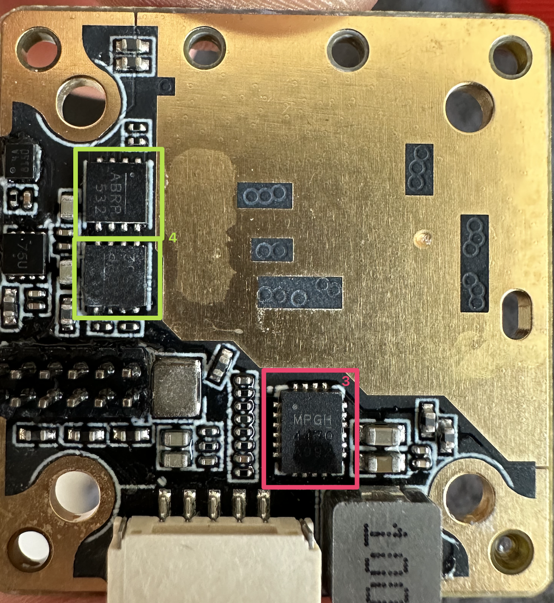

## **HDzero Freestyle v2**

## Chip Identification:

1.  5150 to 5925 MHz High-Efficiency 4 W Power Amplifier **Skyworks SKY66288-11** ([datasheet](/Datasheets/SKY66288_11.pdf))
2.  6V, 2A, Low Quiescent Current Dual, SYNC Buck Regulator **MPS MP2122** ([datasheet](/Datasheets/MP2122.pdf))

3. MPS MPQ4470GL ([datasheet](/Datasheets/MPQ4470GL.pdf))
4. Couldn't identify

## Frequent Issues:

1. **PA is dead:**
   If after crash your antenna fell off, or you have tried to power the vtx without antennna on 1W output and after that you can see image only in couple of centimeters (looks like a stuck PIT mode) then most likely you have a dead PA. 
   **How to check if PA is dead:**
   1. Try to check if any 5V0 pad is shorted to GND. If it is, then you have dead PA.
   2. On the particular Freestyle v2 board, there are two red LEDs soldered in reversed order. (So only one should be on at a time). Official HDzero docs say that one of "the red LEDs on the board" is indicator of PA failure. However, they forgot to pu the image of WHICH LED is indicator. But id you can see all red LEDs are on, then you have dead PA.
   
2. **MP2122 is dead (no power on board):**
   Somestimes MP2122 just decide to die without any reason. If your board doesnt have any LEDs light up on power on, then you most likely have dead MP2122.
