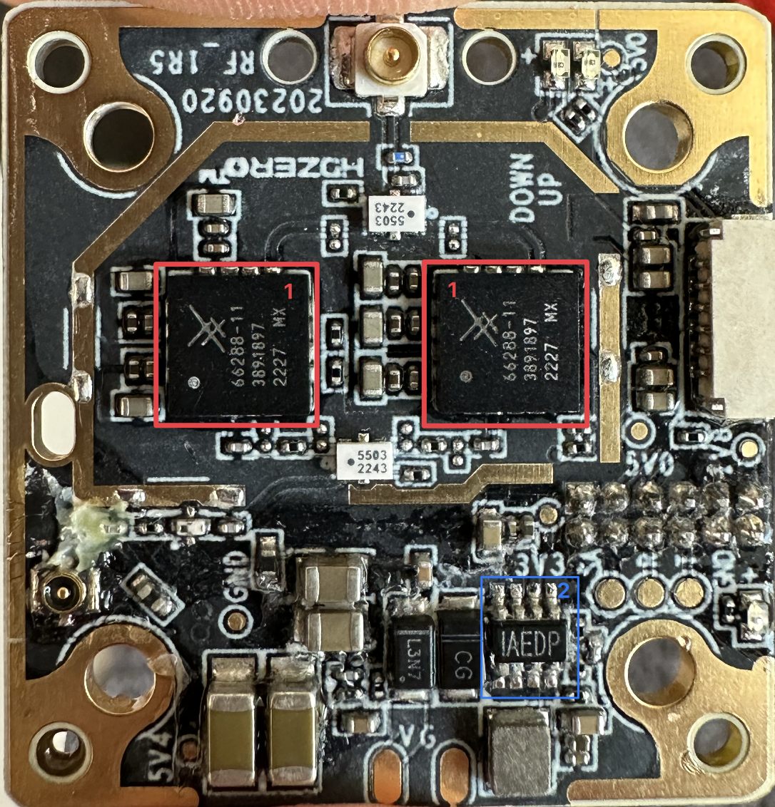

## **HDzero Freestyle v2**

## Chip Identification:

1.  5150 to 5925 MHz High-Efficiency 4 W Power Amplifier **Skyworks SKY66288-11** ([datasheet](/Datasheets/SKY66288_11.pdf))
2.  6V, 2A, Low Quiescent Current Dual, SYNC Buck Regulator **MPS MP2122** ([datasheet](/Datasheets/MP2122.pdf))
